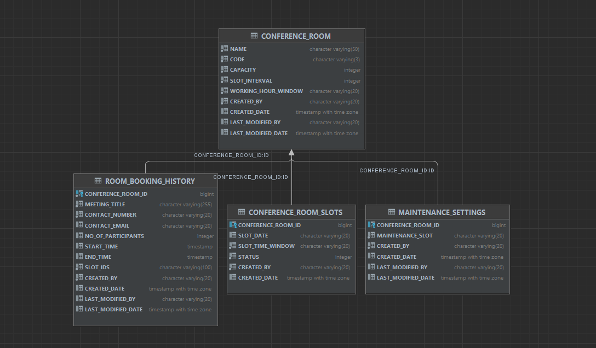
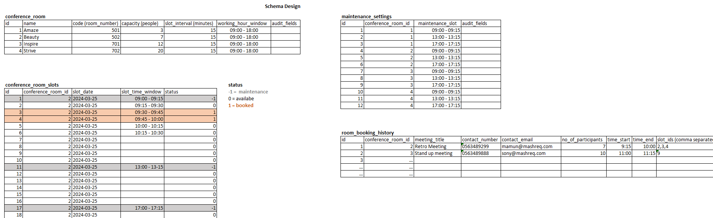
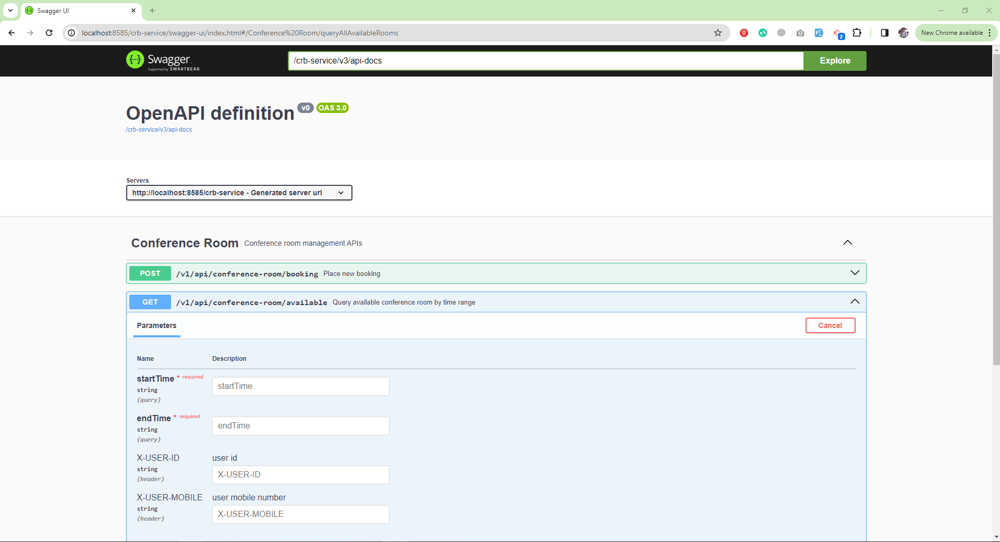

# Conference Room Booking REST API service

Providing all available conference room for the current date, along with their capacities. User will be able to book a available room
for a time slot of 15 min interval.

Features:
- Optimal room search based on number of participants and capacity
- Configurable conference room operating hours (Ex: 8 hours, 10 hours..) and slot interval duration (Ex: 15min, 30min...) 
- Room maintenance time and overlap handling
- Concurrent booking request handling with database records locking

## Table of contents
* [Technology Stack](#technology-stack)
* [Project Structure](#project-structure)
* [Build and Run Project - 3 ways](#build-and-run-project---3-ways)
    + [Pull docker image from docker hub](#pull-docker-image-from-docker-hub)
    + [Build and run docker image locally](#build-and-run-docker-image-locally)
    + [By Intellij IDEA](#by-intellij-idea)
* [Business validation and Exception handling](#business-validation-and-exception-handling)
* [Database, Schema Design and ERD](#database-schema-design-and-erd)
* [Swagger / OpenAPI docs](#swagger-/-openapi-docs)
* [Postman collection](#postman-collection)
* [Special instruction and Test case](#special-instruction-and-test-case)
* [Author](#author)

## Technology Stack
* Java 17
* Spring Boot
* Maven
* h2 Database - inMemory

## Project Structure

## Build and Run Project - 3 ways

### 1. Pull docker image from docker hub
Pull and run docker image from docker hub

    docker pull mn7025/conference-room-service
    docker run -p 8585:8585 --name conference-room-service-cnt mn7025/conference-room-service

### 2. Build and run docker image locally

    mvn clean install
    docker build -t conference-room-service .
    docker run -p 8585:8585 --name conference-room-service-cnt conference-room-service

### 3. Run by using Intellij IDEA
Clone project from github by following link.

    https://github.com/mamun7025/conference-room-booking-service.git

Import project in Intellij IDEA and run.

## Business validation and Exception handling

## Database, Schema Design and ERD
* h2 in-memory database : to connect database use following properties

    Browser URL: http://localhost:8585/crb-service/h2-console/
    JDBC URL: jdbc:h2:file:./db/crb_dev_db;AUTO_SERVER=true
    Username: sa
    Password: root

* ERD Diagram

* Tables with sample data

* Seed SQL Scripts

add shema.sql and data.sql file here

## Swagger / OpenAPI docs
* Swagger UI

    http://localhost:8585/crb-service/swagger-ui/index.html

* OpenAPI docs

    http://localhost:8585/crb-service/v3/api-docs

* Snapshot

* API Request and Response
-- add file here

## Special instruction and Test case
* Some package excluded while running test cases which generally not require to test.
* Used fixed clock time during test case execution (fix time: 2024-03-26 10:00)
* Application clock time possible to control through configuration - only applicable for dev/testing env
* Add a picture for test coverage