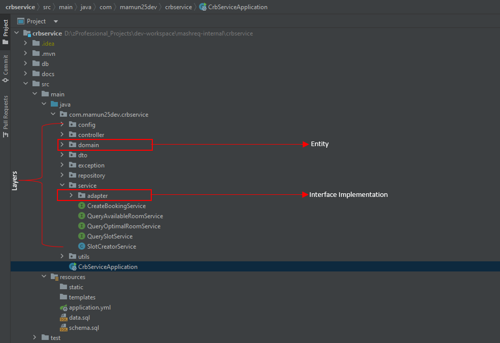

# Conference Room Booking REST API service

Providing all available conference room for the current date, along with their capacities. User will be able to book a available room
for a time slot of 15 min interval.

Features:
- Optimal room search based on number of participants and capacity
- Configurable conference room operating hours (Ex: 8 hours, 10 hours..) and interval duration (Ex: 15min, 30min...) 
- Room maintenance time and overlap handling
- Concurrent request handling with database records locking

## Table of contents
* [Technology Stack](#technology-stack)
* [Project Structure](#project-structure)
* [Build and Run Project - 3 ways](#build-and-run-project-3ways)
    + [Pull docker image from docker hub](#install-python)
    + [Build and run docker image locally](#install-virtualenv)
    + [By Intellij IDEA](#install-virtualenv)
* [Database, Schema Design and ERD](#install-python)
* [Swagger / OpenAPI docs](#install-python)
* [Postman collection](#run-backend-application)
* [Special instruction and Test case](#run-backend-application)
* [Author](#enviorment-setup---frontend)

## Technology Stack
* Java 17
* Spring Boot
* Maven
* h2 Database - inMemory

## Project Structure

## Build and Run Project - 3 ways

### Pull docker image from docker hub
Pull and run docker image from docker hub

    docker pull mn7025/conference-room-service
    docker image ls
    docker run -p 8585:8585 --name conference-room-service-cnt conference-room-service 			>>>> Own account
    docker run -p 8585:8585 --name conference-room-service-cnt mn7025/conference-room-service   >>>> Other PC account

Build and run docker image locally

    mvn clean install
    docker build -t conference-room-service .
    docker run -p 8585:8585 --name conference-room-service-cnt conference-room-service

Push image to docker hub

    docker images
    docker tag conference-room-service:latest mn7025/conference-room-service:latest
    docker push mn7025/conference-room-service:latest

## Database & Schema Design

